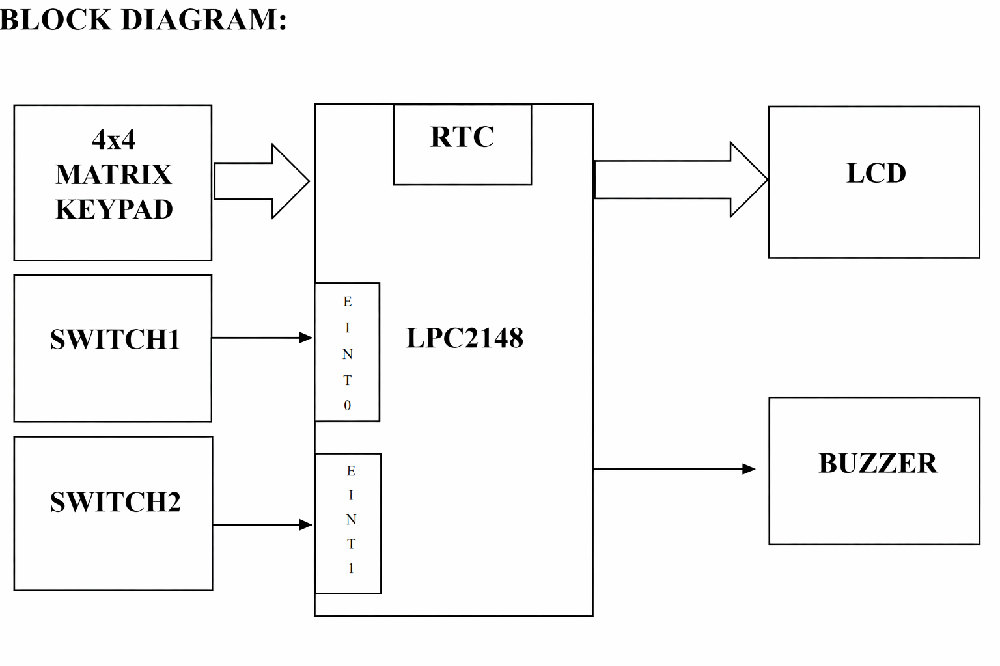
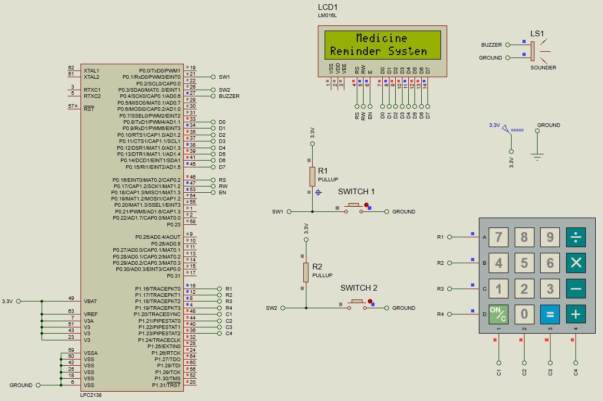
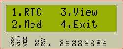
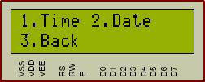
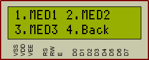
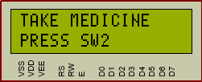

# 💊 User Configurable Medicine Reminder System


An **Embedded Systems Project** developed using the **LPC2148 ARM7 Microcontroller** that reminds users to take medicine at scheduled times using **RTC, LCD display, keypad input, and buzzer alerts**.

---

# 📘 Project Overview

The **User Configurable Medicine Reminder System** helps users manage medication schedules efficiently.

Using a **⌨️ 4x4 Matrix Keypad**, users can configure:

🕒 Real Time Clock (RTC)  
📅 Date and Day  
💊 Medicine Reminder Slots  

The system continuously monitors the RTC and generates alerts when the scheduled medicine time occurs.

### When reminder time matches:

🔔 **Buzzer alert is activated**  
📺 **LCD displays reminder message**  
👆 **User acknowledges using Switch-2**

---

# 🎯 Aim

To develop a **User Configurable Medicine Reminder System** that allows users to set medicine timings and receive automatic alerts at the scheduled time.

---

# 🎯 Objectives

✔ Display RTC time on LCD  
✔ Allow user configuration of medicine timings  
✔ Perform real-time monitoring  
✔ Generate alerts when medicine time occurs  

---

# ✨ Key Features

⏰ RTC based reminder system  
⌨️ 4x4 Matrix keypad interface  
📺 16×2 LCD display for menus  
🔔 Buzzer alert system  
⚡ Interrupt based switches (EINT0 & EINT1)  
💊 Multiple configurable medicine slots  

---

# 🧰 Hardware Components

| 🔧 Component | Description |
|--------------|-------------|
| 🧠 LPC2148 | ARM7 Microcontroller |
| 📺 16x2 LCD | Display interface |
| ⌨️ 4x4 Keypad | User input |
| ⏰ RTC | Real Time Clock |
| 🔔 Buzzer | Alert generation |
| 🔘 Switches | Interrupt input |
| 🔌 USB-UART | Programming |

---

# 🧩 System Block Diagram



The block diagram shows the interaction between **LPC2148, RTC, keypad, LCD, switches, and buzzer**.

---

# 🔌 Circuit Diagram



The schematic represents the **complete hardware connections** of the system including LCD, keypad, RTC, switches, and buzzer.

---

# 🖥 LCD Menu Screens

## ⚙️ Main Menu



This menu allows the user to choose between:

• Edit RTC  
• Configure Medicine  
• View Medicine Slots  
• Exit  

---

## ⏰ Time / Date Configuration



Users can modify **RTC time and date values** using the keypad.

---

## 💊 Medicine Slot Selection



Users can select medicine reminder slots such as:

MED1  
MED2  
MED3  

---

## 🚨 Medicine Alert Screen



When the scheduled time matches, the LCD displays:

**TAKE MEDICINE**  
and the buzzer generates an alert.

---

# ⚙️ Working Principle

### 🔹 Setup Mode (Switch-1)

Pressing **Switch-1** enters configuration mode.

Options displayed on LCD:

• Edit RTC Time  
• Configure Medicine Schedule  

User navigates using the keypad.

---

### 🔹 Clock Mode

If no medicine schedule exists:

📺 LCD continuously displays current **RTC time and date**.

---

### 🔹 Real-Time Monitoring

The controller continuously:

🔄 Reads RTC time  
🔍 Compares with stored medicine schedules  

---

### 🔹 Alert Generation

When time matches a medicine slot:

📺 LCD displays **TAKE MEDICINE**  
🔔 Buzzer produces periodic alert  

A **1 minute acknowledgement timer** starts.

---

### 🔹 User Acknowledgement (Switch-2)

Pressing **Switch-2**:

✔ Stops buzzer  
✔ Clears reminder  
✔ Returns to normal clock display  

---

# 📂 Project Structure

```
USER-CONFIGURABLE-MEDICINE-REMINDER-SYSTEM
│
├── src
│   ├── minor_project.c
│   ├── LCD.c
│   ├── myRTC.c
│   ├── myKPM.c
│   └── menu.c
│
├── include
│   ├── delay.h
│   ├── medicene.h
│   ├── menu.h
│   ├── types.h
│   └── myLCDdefines.h
│
├── images
│   ├── block_diagram.png
│   ├── circuit_diagram1.png
│   ├── menu_display.png
│   ├── date_edit.png
│   ├── add_slot.png
│   └── medicine_alert.png
│
└── README.md
```

---

# 🚀 How to Run the Project

1️⃣ Compile the code using **Keil IDE**  
2️⃣ Generate the **HEX file**  
3️⃣ Upload to LPC2148 using **Flash Magic**  
4️⃣ Connect the hardware circuit  
5️⃣ Power the board and configure medicine slots

---

# 👨‍💻 Author

**Hari Chandan**

🔧 Developed and implemented an **Embedded C based Medicine Reminder System using LPC2148**, integrating RTC, LCD, keypad interface, and buzzer alert modules.

⚙️ Designed a **menu-driven user interface and reminder logic** to allow users to easily configure medicine schedules and receive timely alerts.
---
